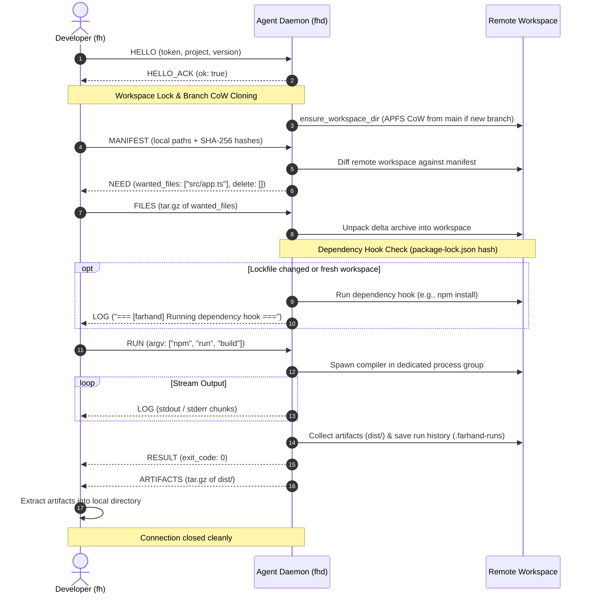

# Farhand Internal Architecture & Wire Protocol

Farhand is designed as a **remote build and test offloader with zero external system binaries, transport-agnostic by design** and written in pure Rust. It allows lightweight or battery-constrained local machines to transparently execute compilation, testing, and packaging jobs on powerful remote agent machines over a raw or tunneled TCP socket, streaming output in real time and pulling back build artifacts.

---

## 1. System Topology & The Two Binaries

```
+------------------------+                           +-------------------------+
|   Developer Machine    |                           |    Remote Build Agent   |
|                        |                           |                         |
|   `fh` (Client CLI)    |  === Raw or Tunneled ===> |    `fhd` (Daemon)       |
|                        |      TCP (Port 9876)      |                         |
|  - Directory Scanner   |                           |  - TCP Framing Reader   |
|  - SHA-256 Hasher      |                           |  - Workspace Lock Mgr   |
|  - Delta Tar Streamer  |                           |  - APFS CoW Cloner      |
|  - Live Log Renderer   |                           |  - Dependency Hook Mgr  |
|  - Artifact Unpacker   |                           |  - Process Group Exec   |
+------------------------+                           +-------------------------+
```

### The Client: `fh`
The client CLI is invoked directly by developers instead of running local build tools (e.g., `fh npm run build` or `fh cargo test`):
1. **Discovers Configuration**: Evaluates CLI arguments, environment variables, and `.farhand.yaml`.
2. **Scopes Project & Branch**: Automatically inspects `.git/HEAD` to transparently scope branches as `<repo>__<branch>`.
3. **Scans Local Files**: Applies `.gitignore`, `.farhand-ignore`, and default ignore rules to build a local manifest with streaming SHA-256 hashes.
4. **Exchanges Manifest & Streams Delta**: Sends the `MANIFEST` frame, receives a `NEED` frame specifying only changed files, packages them into a `tar.gz` stream (`FILES` frame).
5. **Streams Remote Execution**: Sends `RUN`, renders live `LOG` frames from remote `stdout`/`stderr`, handles signals/cancellation, and receives `RESULT`.
6. **Extracts Build Artifacts**: Receives the `ARTIFACTS` frame containing outputs and extracts them locally.

### The Daemon: `fhd`
A persistent service listening on a TCP port (default `9876`):
1. **Authenticates Handshake**: Validates secret authentication token and protocol version compatibility (`HELLO` / `HELLO_ACK`).
2. **Acquires Project Lock**: Coordinates concurrency via per-project async mutexes and global concurrency limits (`QUEUED` frame).
3. **Resolves & Clones Workspaces**: Maintains persistent workspaces per project. Automatically performs instantaneous APFS Copy-on-Write (`clonefile`) branch forking from canonical seed workspaces (`main`/`master`).
4. **Diffs Manifests & Unpacks Delta**: Computes missing/modified files and safely removes extraneous files while adhering strictly to the Section 5.1 deletion safety rule.
5. **Executes Dependency Hooks**: Detects project lockfiles, compares hashes against `.farhand-state.json`, and triggers dependency installation (`npm install`, `cargo fetch`, etc.) if needed.
6. **Process Group Isolation**: Spawns compilation commands inside dedicated process groups (`setpgid`), streaming live logs and ensuring clean termination (`SIGTERM` + `SIGKILL`) on disconnect.
7. **Resolves Artifacts & Saves Run History**: Packs generated build outputs (`dist/`, `target/release/`, etc.), records telemetry to `.farhand-runs/`, and transmits artifacts.

---

## 2. Binary Framing Wire Protocol

Farhand communicates over raw TCP without relying on SSH or HTTP overhead. All frames use a rigid **20-byte binary header** followed by a variable-length payload.

### Frame Layout (Network Byte Order / Big-Endian)

```
 0                   1                   2                   3
 0 1 2 3 4 5 6 7 8 9 0 1 2 3 4 5 6 7 8 9 0 1 2 3 4 5 6 7 8 9 0 1
+-+-+-+-+-+-+-+-+-+-+-+-+-+-+-+-+-+-+-+-+-+-+-+-+-+-+-+-+-+-+-+-+
|          Magic Bytes (0x4648)         |    Version    |  MsgType  |
+-+-+-+-+-+-+-+-+-+-+-+-+-+-+-+-+-+-+-+-+-+-+-+-+-+-+-+-+-+-+-+-+
|                         Flags (32-bit)                        |
+-+-+-+-+-+-+-+-+-+-+-+-+-+-+-+-+-+-+-+-+-+-+-+-+-+-+-+-+-+-+-+-+
|                      Payload Length (32-bit)                  |
+-+-+-+-+-+-+-+-+-+-+-+-+-+-+-+-+-+-+-+-+-+-+-+-+-+-+-+-+-+-+-+-+
|                      Reserved (64-bit)                        |
|                                                               |
+-+-+-+-+-+-+-+-+-+-+-+-+-+-+-+-+-+-+-+-+-+-+-+-+-+-+-+-+-+-+-+-+
|                         Payload Data                          |
|                             ...                               |
+-+-+-+-+-+-+-+-+-+-+-+-+-+-+-+-+-+-+-+-+-+-+-+-+-+-+-+-+-+-+-+-+
```

| Field | Size | Description |
| :--- | :--- | :--- |
| `Magic` | 2 bytes | Protocol identifier `0x4648` (ASCII `"FH"`). |
| `Version` | 1 byte | Protocol version (currently `0x01`). |
| `MsgType` | 1 byte | Message type enum (see table below). |
| `Flags` | 4 bytes | Reserved bitflags for future stream negotiation. |
| `Length` | 4 bytes | Big-endian 32-bit integer declaring payload size (Max: 256 MB). |
| `Reserved` | 8 bytes | Reserved padding for 64-bit alignment and future expansions. |
| `Payload` | Variable | UTF-8 JSON or raw `tar.gz` stream. |

### Message Types (`MsgType`)

| Code | Name | Direction | Payload Type | Description |
| :--- | :--- | :--- | :--- | :--- |
| `0x01` | `HELLO` | Client -> Agent | JSON (`HelloPayload`) | Initiates session with token, project name, and protocol version. |
| `0x02` | `HELLO_ACK` | Agent -> Client | JSON (`HelloAckPayload`) | Confirms authentication or reports rejection error. |
| `0x03` | `MANIFEST` | Client -> Agent | JSON (`ManifestPayload`) | Full list of local files with relative paths, modes, and SHA-256 hashes. |
| `0x04` | `NEED` | Agent -> Client | JSON (`NeedPayload`) | List of missing/changed file paths required by agent, plus files to delete. |
| `0x05` | `FILES` | Client -> Agent | Raw `tar.gz` | Compressed archive containing only the requested `NEED` files. |
| `0x06` | `RUN` | Client -> Agent | JSON (`RunPayload`) | Remote command argv, custom outputs, cwd, and cache flags. |
| `0x07` | `LOG` | Agent -> Client | JSON (`LogPayload`) | Real-time chunk of remote `stdout` or `stderr`. |
| `0x08` | `RESULT` | Agent -> Client | JSON (`ResultPayload`) | Command exit code and error description (if any). |
| `0x09` | `ARTIFACTS` | Agent -> Client | Raw `tar.gz` | Compressed archive of build outputs resolved on the agent. |
| `0x0A` | `QUEUED` | Agent -> Client | JSON (`QueuedPayload`) | Informs client that workspace is locked by another run; waits in queue. |
| `0x0B` | `STATUS_REQ` | Client -> Agent | JSON | Agent capability and current load probe. |
| `0x0C` | `STATUS_RESP`| Agent -> Client | JSON (`StatusPayload`) | System load, active runs, capacity, and tags. |
| `0x0D` | `PUT_TMPL` | Client -> Agent | JSON (`PutTemplatePayload`) | Registers a dynamic project template with the agent. |
| `0x0E` | `HISTORY` | Client -> Agent | JSON (`HistoryRequestPayload`) | Queries recent run history for a project. |
| `0x0F` | `HISTORY_RESP`| Agent -> Client| JSON (`HistoryResponsePayload`)| Returns list of historical run records. |
| `0x10` | `CLEAN` | Client -> Agent | JSON (`CleanRequestPayload`) | Requests pruning of branch workspaces or compiler caches. |
| `0x11` | `CLEAN_RESP` | Agent -> Client | JSON (`CleanResponsePayload`)| Confirms workspace/cache deletion and bytes freed. |

---

## 3. Section 5.1 Deletion Safety Rule

To ensure remote caches survive across runs without accumulating orphaned files, Farhand enforces a strict deletion boundary on the agent:

> **The Section 5.1 Rule**:
> The agent daemon **must never** delete a file in the remote workspace unless:
> 1. It exists on the remote agent filesystem.
> 2. It is **absent** from the client's `MANIFEST`.
> 3. It is **NOT** inside a directory matching default ignore rules (`node_modules/`, `target/`, `.venv/`, `.git/`, `dist/`, etc.).
> 4. It is **NOT** an agent-internal metadata file (`.farhand-state.json`, `.farhand-runs/`, `.farhand-last-used`).

This guarantees that compiler outputs, package manager dependency caches, and virtual environments survive across builds, while deleted project source files are cleanly removed.

---

## 4. Process Group Isolation & Cancellation

When compiling heavy codebases, unexpected disconnections (e.g. laptop lid closing or `Ctrl+C`) must not leave orphaned compiler trees running on the agent.

1. **Dedicated Process Group**: Commands are spawned with `cmd.process_group(0)` (POSIX `setpgid`).
2. **Cancellation Detection**: The agent actively monitors the TCP socket. If the client connection drops prematurely:
   - A `SIGTERM` signal is immediately dispatched to `-pgid` to terminate the entire process hierarchy.
   - The agent waits up to 3 seconds for graceful shutdown.
   - If processes remain alive after 3 seconds, a `SIGKILL` signal is dispatched to `-pgid`.
   - The project workspace lock is released cleanly.

---

## 5. End-to-End Execution Sequence


